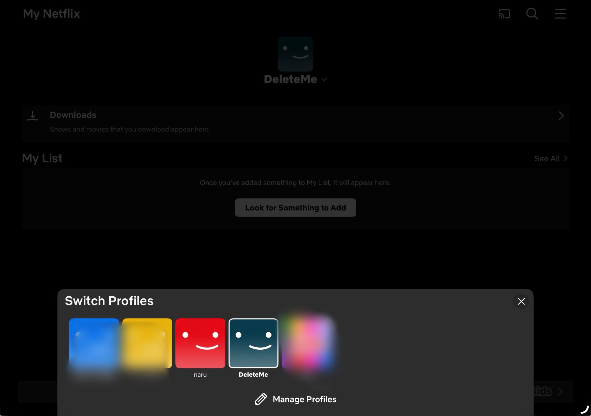
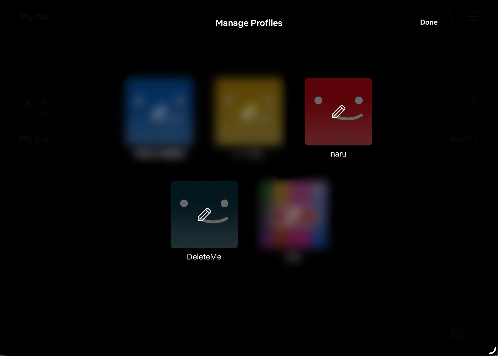
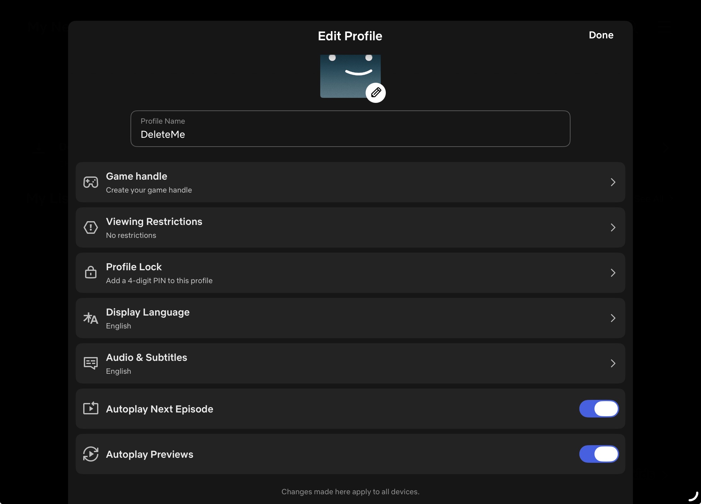
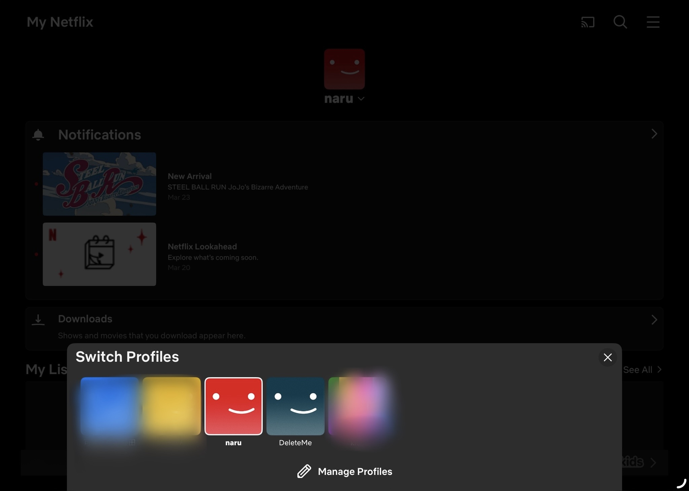
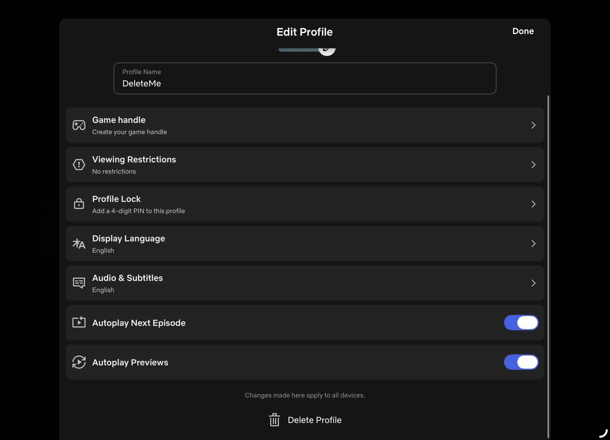
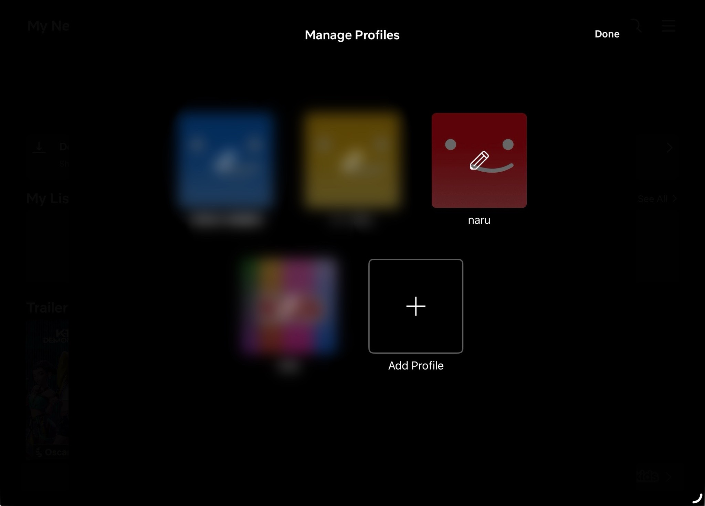
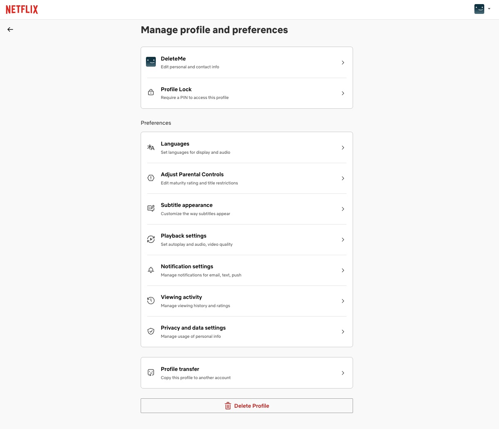

# Why Can't I Delete My Own Netflix Profile?

I often watch Netflix on my iPad on the weekends. One day, I decided to organize my profiles and went to "Manage Profiles" to delete a sub-profile that I no longer needed. In "Manage Profiles," you can set language preferences and viewing restrictions, so I naturally assumed I could also delete a profile from there.  

First, I went to "My Netflix" tab while logged into the "DeleteMe" profile and tapped on the profile icon to open "Switch Profiles." From there, I selected "Manage Profiles."

This brought up the "Manage Profiles" screen, where each profile has a pencil icon indicating it can be edited. I tapped on the "DeleteMe" profile.

This opened the "Edit Profile" page, where I could change the profile name, language, viewing restrictions, and other settings. But there was no delete button anywhere on this screen.

## How to Delete My Profile
After some searching, I discovered that to delete a profile, you have to switch to a *different* profile first. So I switched to my main profile, "naru," and tapped "Manage Profiles" from there.

I selected the "DeleteMe" profile from the Manage Profiles screen (the same screen I had seen before).

And this time, the "Edit Profile" page for "DeleteMe" had a "Delete Profile" button at the very bottom. The exact same profile, the exact same "Edit Profile" screen, but with one crucial difference: I could only see the delete option when accessing it from another profile.
  

After clicking "Delete Profile," a confirmation prompt appeared, and the "DeleteMe" profile was finally removed.

## UX Analysis
The biggest issue with this experience was that my **mental model** didn’t align with how the system actually worked. A **mental model** refers to the predictions and expectations users hold in their minds about how a system should work. In my case, I had a mental model that “I should be able to manage all my profile settings while logged into that profile.” While I could change my name, language settings, viewing restrictions, and other settings all from that profile, I couldn’t delete it. I felt this was a design that betrayed natural expectations.  
Another issue was **discoverability**. **Discoverability** refers to how easily a user can find out “what they can do” and “how to do it.” In this case, there were absolutely no hints or explanations regarding the mechanism where the delete button
doesn’t appear unless you switch to a different profile. If there had been a message on the “Edit Profile” screen saying, “To delete, please access from a different profile,” users would at least know what to do next. However, in reality, there was nothing, leaving users with no choice but to figure it out through trial and error.

That said, there is room to defend Netflix’s design intent. The decision to prevent users from deleting their own profiles directly may be intended to prevent accidental deletion. It is understandable that they would want to avoid the risk of
accidental deletion, especially for profiles used by children. However, this safety measure comes at the expense of discoverability. For example, if they displayed a delete button on the Edit Profile screen and added a confirmation step requiring a password, users could easily find the delete function while still preventing accidental deletion.

Interestingly, I also tried performing the same operation on a computer, and found that you *can* delete your own profile from your own profile on the desktop version. This inconsistency between the iPad app and the desktop experiences makes the iPad's limitation feel even more arbitrary. Perhaps the Netflix development team assumes that children are more likely to use tablets than PCs, so they applied stricter safeguards on the iPad app.

